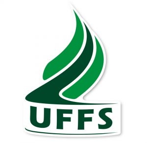

```{r setup, include=FALSE}
knitr::opts_chunk$set(echo = TRUE)
```


# **Software R: capacitação em análise estatística de dados utilizando um software livre**

O objetivo principal do projeto é atender alunos, bolsistas, comunidade interna e externa através de cursos de capacitação na análise de dados primários ou secundários utilizando um *software* livre de análise estatística, especificamente o *software* **R** em seu console **RStudio**. Ainda, objetiva-se a troca de experiências vinculando dados provindos de diferentes pesquisas dos participantes.

   

<!--
**Incrição Curso 2018 - 30 vagas** - Em breve!

[Inscrição Curso 2018 - 30 vagas](https://docs.google.com/forms/d/e/1FAIpQLSeeHVoU8uR_dUB1rxoXJ5YD64ClVuePztOMIRe98o12DXWsJg/viewform)
-->


<!--
## Avaliação do curso básico

O formulário de avaliação do curso básico, edição 2017.2, está disponível para preenchimento.

[Avaliação Curso Básico 2017.2](https://docs.google.com/forms/d/1M2nUtu-pAe2471H-hHs2HyIFdYgJPK0NDXNnLcgSUUo)
-->
<!--
[Demonstra interesse no curso?](https://docs.google.com/forms/d/e/1FAIpQLSdPGJINhPg7EozUzzLBt4iKWFDGLgE0_osokGX7L2K3ygtpUA/viewform?usp=sf_link)
-->
<!--
<i class="fa fa-file-archive-o" aria-hidden="true"></i>
-->

O projeto originou-se da sua aprovação em Edital de Apoio a Programas de Extensão (Nº 522/GR/UFFS/2016) da Universidade Federal da Fronteira Sul (UFFS).

[Artigo:](http://ojs.unesp.br/index.php/revista_proex/article/download/1823/2073) SMOLSKI, F. M. S. et al. Capacitação em análise estatística de dados utilizando o software livre R. **Rev. Ciênc. Ext.** v.14, n.3, p.123-134, 2018.
